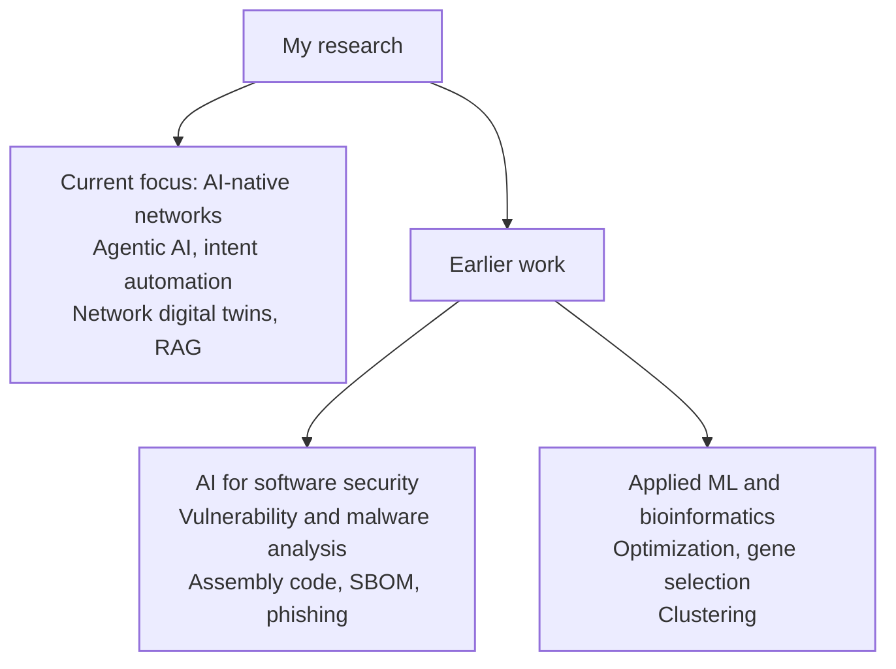

# Hi, I'm Sudipta Acharya

**Postdoctoral Fellow at the University of Ottawa (SCVIC & NEXTCON Lab)**  
**MITACS Accelerate Researcher with Nokia Bell Labs**

My current research examines **agentic and multi-agent AI systems for translating human network intent into verified, executable behavior** in AI-native 6G networks. This work is collaborative across academic and industrial research teams; project and publication credits are stated below.

[LinkedIn](https://www.linkedin.com/in/sudipta-acharya-ml/) | [ORCID](https://orcid.org/0000-0002-8716-8214)

## Research in one picture

## What I research

- **Agentic and multi-agent LLM systems** for autonomous network management
- **Intent-based networking**: translating natural-language goals into deployable configurations
- **Network Digital Twins** that can be synthesized and verified automatically
- **Standards-aware RAG** for network engineering knowledge and operational support
- **AI for software security**: vulnerability and malware analysis, assembly-code understanding, SBOMs, and phishing detection
- **Earlier applied ML and bioinformatics**: multi-objective optimization, gene selection, and clustering

## Current collaborative research

| Project | Research question | Scope and attribution |
|---|---|---|
| **NDT Factory** | Can networks build new digital twins when unfamiliar services appear? | Collaborative research with Petar Djukic and colleagues at Nokia Bell Labs and the University of Ottawa on generating and verifying executable Network Digital Twins from semantic specifications. |
| **Intent2QoS** | Can an operator describe the desired outcome instead of writing low-level configuration? | Co-authored with Burak Kantarci: a language-model-driven pipeline that translates natural-language intent into deployable traffic-shaping configurations. |
| **TM Forum Standards Assistant** | How can engineers navigate large, interconnected telecom standards efficiently? | A LangChain-based RAG prototype I developed to explore question answering grounded in TM Forum specifications. |
| **Autogenic Network Management** | What comes after today's agentic network automation? | Co-authored with Petar Djukic, Takai Eddine Kennouche, and Burak Kantarci: a standards-informed research roadmap for self-evolving network automation under human oversight. |

## Earlier work: AI for software security

During my work with the [L1NNA Research Laboratory](https://l1nna.com/) at Queen's University, I contributed to collaborative research applying machine learning to software security. This included explainable assembly-code understanding for reverse engineering and vulnerability analysis ([Asm2Seq](https://doi.org/10.1145/3592623)), automated Software Bills of Materials for software supply-chain visibility ([SBOM generation](https://arxiv.org/abs/2403.08799)), and obfuscation-resilient malware and phishing detection.

## Selected publications

- **From Agentic to Autogenic Network Management for AI-Native 6G and Beyond: A Standards Perspective** — with Petar Djukic, Takai Eddine Kennouche, and Burak Kantarci; IEEE Network, 2026. [Preprint](https://arxiv.org/abs/2607.06786)
- **Intent2QoS: Language Model-Driven Automation of Traffic Shaping Configurations** — with Burak Kantarci, 2026. [Preprint](https://arxiv.org/abs/2601.18974)
- **Toward a Robust Detection of PowerShell Malware against Code Mixing and Obfuscation by Using Sentence Transformer and Similarity Learning** — with Zhiwei Fu, Leo Song, Steven H. H. Ding, and Furkan Alaca; ACM Transactions on Privacy and Security, 2025. [DOI](https://doi.org/10.1145/3771542)

For my complete publication history, please see my [ORCID record](https://orcid.org/0000-0002-8716-8214).

## Code in focus

- [`declarative-agents`](https://github.com/Acharya320/declarative-agents) -- my working fork for research experiments. The [original framework](https://github.com/petar-djukic/declarative-agents) was created by Petar Djukic / Nokia Bell Labs; it expresses tools, states, transitions, signals, and budgets in YAML interpreted by a Go runtime.

More reproducible research artifacts and demonstrations are being prepared for public release.

## Current focus

I am currently exploring how **semantic reasoning, LLM orchestration, verification, and network automation** can work together to make future networks more adaptive without losing operator control.

## Tools and methods

`Python` | `Go` | `Large Language Models` | `Multi-Agent Systems` | `LangChain` | `RAG` | `Semantic Reasoning` | `Network Automation`

---

I also enjoy translating complex research ideas into clear explanations for students, practitioners, and the broader community.
