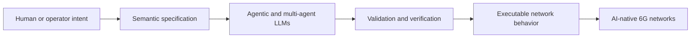

# Hi, I'm Sudipta Acharya

**Postdoctoral Fellow at the University of Ottawa (SCVIC & NEXTCON Lab)**  
**MITACS Accelerate Researcher with Nokia Bell Labs**

I build **agentic and multi-agent AI systems that translate human network intent into verified, executable behavior** for AI-native 6G networks.

[LinkedIn](https://www.linkedin.com/in/sudipta-acharya-ml/) | [ORCID](https://orcid.org/0000-0002-8716-8214)

## Research in one picture

## What I research

- **Agentic and multi-agent LLM systems** for autonomous network management
- **Intent-based networking**: translating natural-language goals into deployable configurations
- **Network Digital Twins** that can be synthesized and verified automatically
- **Standards-aware RAG** for network engineering knowledge and operational support
- **Applied machine learning**, including cybersecurity and software vulnerability analysis

## Selected research systems

| System | Research question | Contribution |
|---|---|---|
| **NDT Factory** | Can networks build new digital twins when unfamiliar services appear? | A multi-agent LLM framework for generating and verifying executable Network Digital Twins from semantic specifications. |
| **Intent2QoS** | Can an operator describe the desired outcome instead of writing low-level configuration? | A language-model-driven pipeline that translates natural-language network intent into deployable traffic-shaping configurations. |
| **TM Forum Standards Assistant** | How can engineers navigate large, interconnected telecom standards efficiently? | A LangChain-based RAG application grounded in TM Forum specifications. |
| **Autogenic Network Management** | What comes after today's agentic network automation? | A research roadmap toward networks that can progressively generate, evolve, and reorganize their automation software under operator intent and human oversight. |

## Selected publications

- **From Agentic to Autogenic Network Management for AI-Native 6G and Beyond: A Standards Perspective** — IEEE Network, 2026. [Preprint](https://arxiv.org/abs/2607.06786)
- **Intent2QoS: Language Model-Driven Automation of Traffic Shaping Configurations** — 2026. [Preprint](https://arxiv.org/abs/2601.18974)
- **Toward a Robust Detection of PowerShell Malware against Code Mixing and Obfuscation by Using Sentence Transformer and Similarity Learning** — ACM Transactions on Privacy and Security, 2025. [DOI](https://doi.org/10.1145/3771542)

## Code in focus

- [`declarative-agents`](https://github.com/Acharya320/declarative-agents) -- my working fork of a declarative agent framework in which tools, states, transitions, signals, and budgets are expressed in YAML and interpreted by a Go runtime.

More reproducible research artifacts and demonstrations are being prepared for public release.

## Current focus

I am currently exploring how **semantic reasoning, LLM orchestration, verification, and network automation** can work together to make future networks more adaptive without losing operator control.

## Tools and methods

`Python` | `Go` | `Large Language Models` | `Multi-Agent Systems` | `LangChain` | `RAG` | `Semantic Reasoning` | `Network Automation`

---

I also enjoy translating complex research ideas into clear explanations for students, practitioners, and the broader community.
